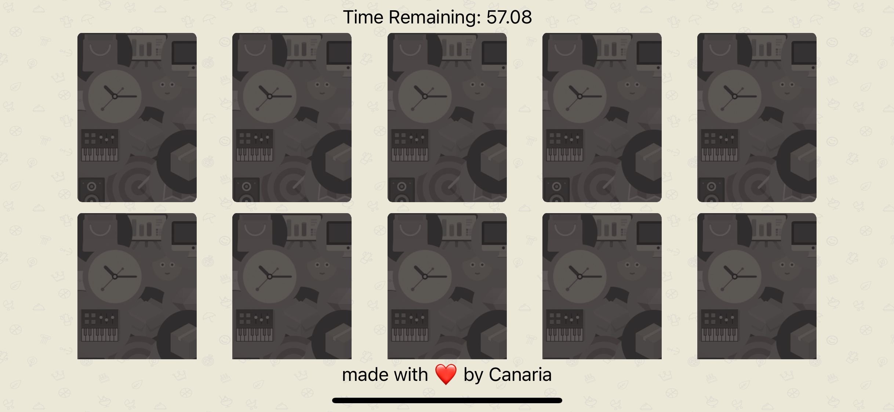
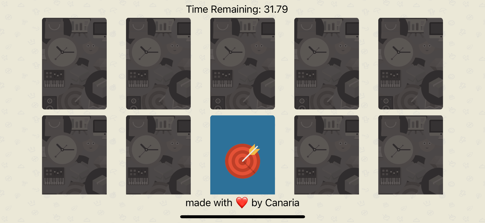
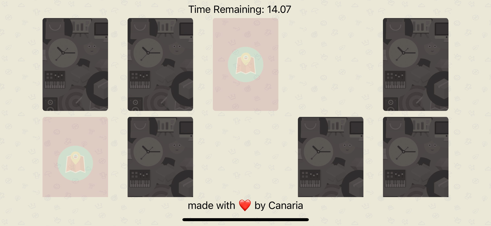
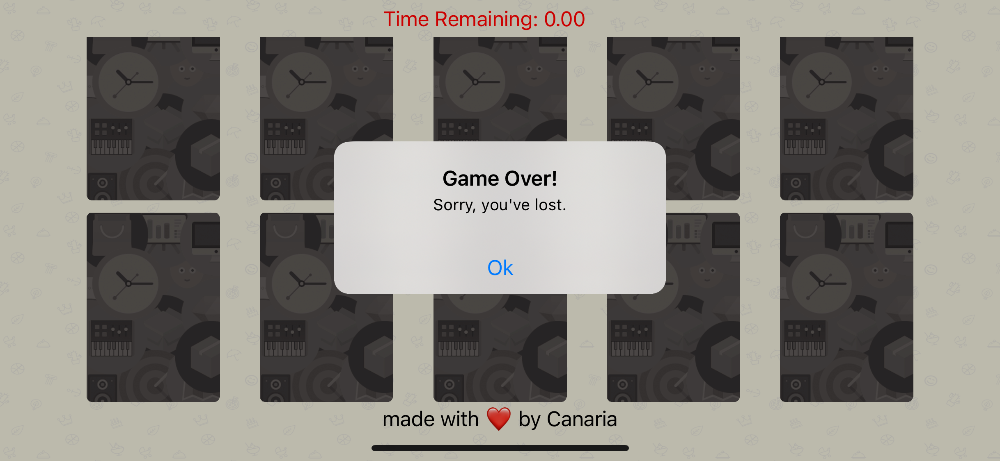
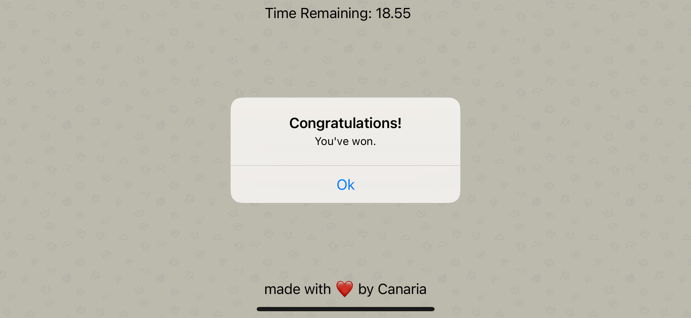

# Match

Match is a card game typically played by a single player, made for iOS Devices.

  

 | 
---------------------------|---------------------------
 | 

## About
This project was a part of Learn iOS App Development in 28 Days Series by [Chris Ching](https://codewithchris.com/ios-app-development/).
